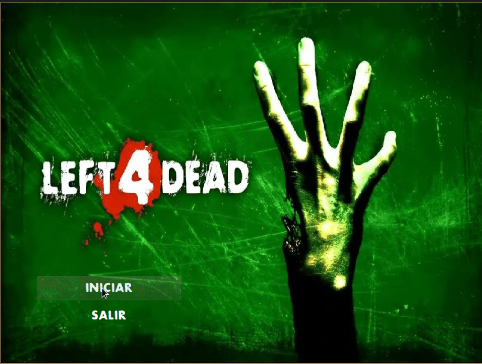
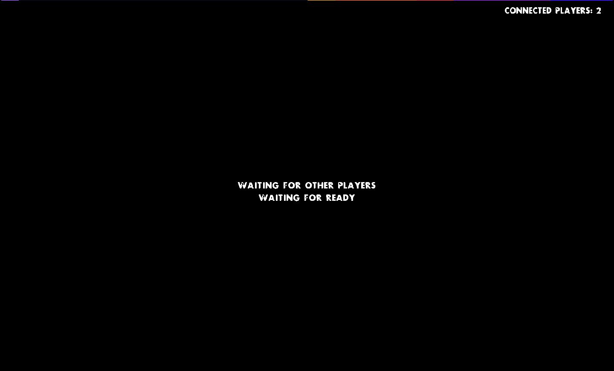
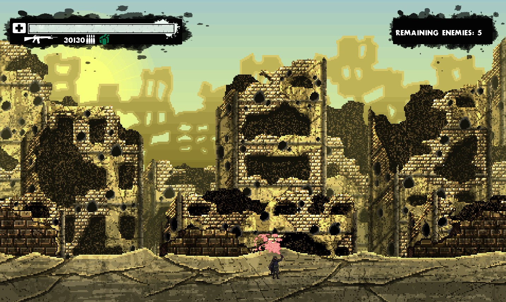
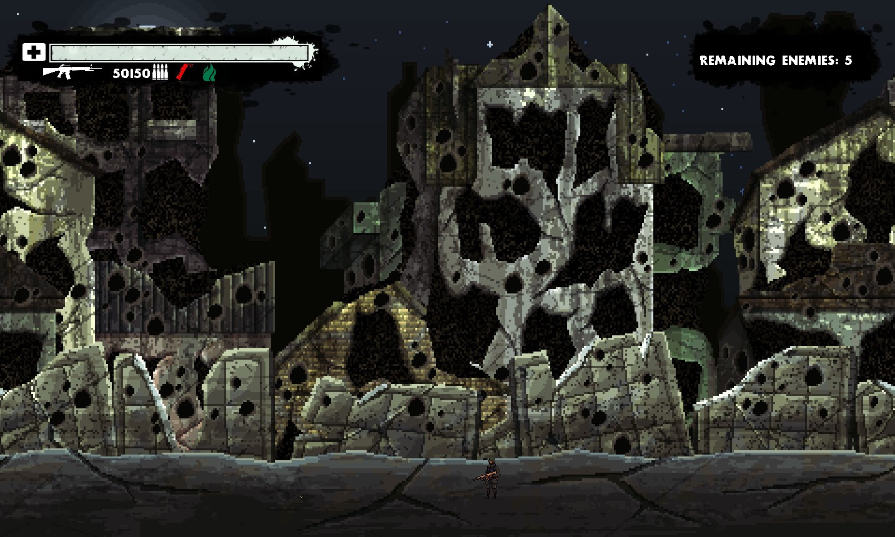
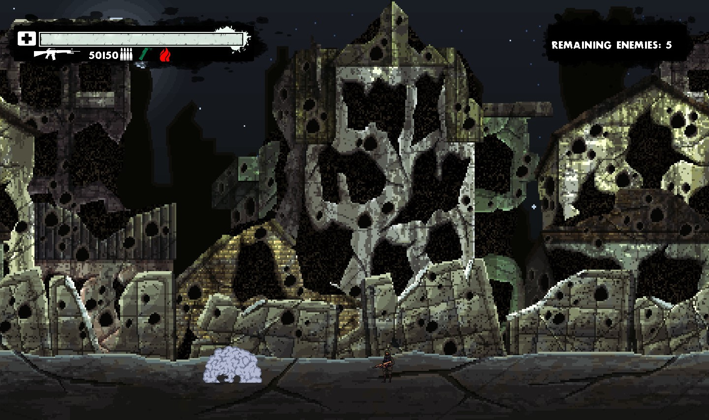
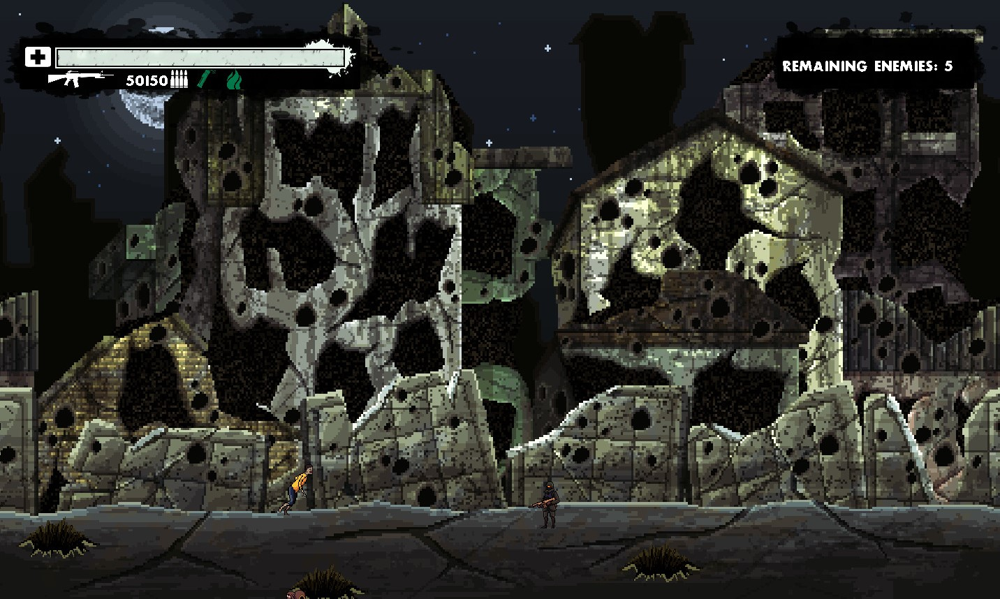
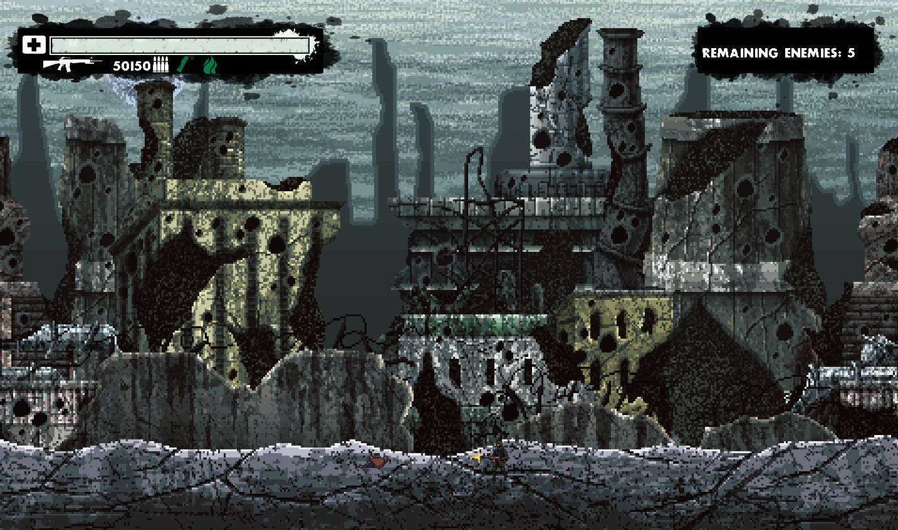

# Left 4 Dead

# Taller de Programación I - Cátedra Veiga - FIUBA

# Trabajo Práctico Final

| Padrón | Alumnos                  |
|--------|--------------------------|
| 106753 | Bravo, Nicolas Francisco | 
|  96467 | Chávez Cabanillas, José  |
| 106171 | Davico, Mauricio         |


# Tabla de Contenidos

- [Guía de Instalación](#guia-de-instalación)
    - [Requisitos](#requisitos)
    - [Instalación de Dependencias](#instalación-de-dependecias)
- [Guía de Usuario](#guía-de-usuario)
    - [Formas de ejecución](#formas-de-ejecucción)
        - [Server](#server)
        - [Cliente](#cliente)
- [Cómo jugar](#cómo-jugar)
    - [Movimientos](#movimientos)
    - [Crear Partida](#crear-partida)
    - [Unirse a Partida](#unirse-a-partida)
- [Juego](#flujo-de-juego)
    - [Sala de espera](#sala-de-espera)
    - [Jugar](#jugar)


# Guía de instalación

## Requisitos

Uno de los requisitos más importantes que utiliza el juego es el sistema operativo sobre el cual se ejecuta, para lo cual se debera contar con alguna distribucion que utilice GNU/Linux como sistema operativo.

Además se debe contar tanto con git, CMake y Make, para la descarga del juego así como para la compilación del juego.

## Instalación de Dependecias

Los paquetes que usa el juego para ejecutarse, son SDL, Qt5, YAML-cpp y GoogleTest, dependiendo del gestor de paquetes del sistema operativo que se use, los paquetes a instalar son los mismos.

### Ubuntu: 

```
    sudo apt-get update
    sudo apt-get install git cmake make libsdl2-dev libsdl2-image-dev libsdl2-ttf-dev qt5-default qtmultimedia5-dev libqt5multimedia5-plugins libyaml-cpp-dev libsdl2-mixer-dev
```

## Configuración e Instalación

Como primer paso se debe clonar este repositorio con el siguiente comando:
```
    git clone git@github.com:mdavic0/7542_Taller_TP_Final.git 
```
Después de eso se debe ingresar a la carpeta donde se clonó el repositorio, donde se tienen dos opciones de instalacion.

* CMake - Make: construye el proyecto sin instalarlo, para eso simplemente se deben ejecutar los siguientes comandos, dentro de la carpeta:

```
    mkdir build
    cd build
    cmake ..
    make -j4
```

* Tests: una vez terminada la compilación basta con ingresar el siguiente comando para ejecutar los tests que se elaboraron para el proyecto.

``` 
    ctest
```

* Instalación: terminada la construcción del proyecto, basta con ingresar el siguiente comando que instalará el juego y el servidor en la carpeta /usr/local/bin, 

```
    sudo make install
```

Aclaración para la correcta ejecución del programa debe ir a la carpeta donde se instalo el juego.

# Guía de Usuario

## Formas de ejecucción

### Server

Localizarse dentro de la carpeta build, y ejecutar por consola el siguiente comando:

```
    ./left4dead-server [PORT]
```

Si quiere ejecutar el servidor del juego bastará con ejecutar el mismo comando, pero sin escribir "./", dentro de la carpeta de instalación.

### Cliente

Localizarse dentro de la carpeta build, y ejecutar por consola el siguiente comando:

```
    ./left4dead-client
```
Si quiere ejecutar el servidor del juego bastará con ejecutar el mismo comando, pero sin escribir "./", dentro de la carpeta de instalación.

## Cómo Jugar

### Movimientos

Los movimientos para ontrolar al Operador son los siguiente:

* Teclas A - W - S - D: Movimiento en las cuatro direcciones.
* Tecla SPACE: Disparo.
* Tecla Q: Habilidad especial (Granadas).
* Tecla E: Granada de humo.
* Tecla R: Recargar.
* Tecla F: Reanimar.

### Conectarse al servidor

Desde el inicio de la aplicación, al oprimir el botón Iniciar, automáticamente se pasará a la ventana de conexión con el Servidor, donde se necesitará la Ip y el puerto donde esta alojado el Servidor.



### Crear Partida

Una vez conectado al servidor se podra crear una partida, ingresando el nombre de la partida seleccionando el modo de juego y la dificultad, así como también al personaje con el jugar.


### Unirse a Partida

Conectado al servidor, otra opción es la de poder unirse a la partida, para lo cual se necesitara un código de único que se le dará al creador de la partida. Con ese código podrá unirse a la partida sin ningún inconveniente.


## Flujo de Juego

### Sala de espera

Antes de cada inicio de partida se deberá esperar a que el creador de la partida le de inicio a la misma. En este instante se mostrará dos salas de espera, dependiendo de si fuiste el creador o el que se unió a la partida.

Sala de espera para el creador de la partida


Sala de espera para el que se unió a la partida



### Jugar
Una vez terminado la espera solo queda disfrutar el juego en compañia de amigos. 






